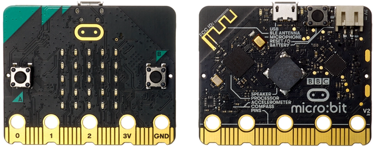

## ¿Qué es micro:bit?

Micro:bit es una placa de desarrollo electrónico diseñada para enseñar a los estudiantes la programación y el pensamiento computacional. Está diseñada especialmente para ser fácil de usar y se puede programar utilizando una variedad de lenguajes de programación, con [bloques](https://makecode.microbit.org), Scratch, Blockly y Python.

Micro:bit fue creada por la BBC en colaboración con una serie de socios, incluyendo el Ministerio de Educación del Reino Unido y una serie de empresas tecnológicas. La placa micro:bit fue diseñada para ser utilizada en la enseñanza de la programación y el pensamiento computacional en las escuelas del Reino Unido, y se distribuyó gratuitamente a más de un millón de estudiantes en el año 2015.

Desde entonces, micro:bit se ha convertido en una placa de desarrollo electrónica muy popular en todo el mundo y ha sido utilizada en una amplia variedad de proyectos y actividades educativas en todo el mundo. Actualmente, la placa micro:bit es desarrollada y mantenida por la Fundación micro:bit, una organización sin fines de lucro que trabaja para promover el uso de la tecnología en la educación.

La placa micro:bit tiene un procesador de baja potencia, una pantalla de leds, sensores de movimiento y orientación, y puede conectarse a otros dispositivos mediante Bluetooth. También cuenta con una serie de botones y entradas de pin para conectar componentes externos.

Algunas de las cosas que se pueden hacer con micro:bit son:

* Crear proyectos de robótica y control de motores
* Desarrollar aplicaciones para la Internet de las cosas (IoT)
* Crear juegos y aplicaciones interactivas
* Realizar experimentos científicos y de ingeniería
* Aprender a programar y a pensar de manera computacional

micro:bit es una herramienta muy versátil y puede ser utilizada para una amplia variedad de proyectos y actividades educativas.

## Detalles

La placa micro:bit es una placa de desarrollo electrónica compacta y de bajo costo que se ha diseñado especialmente para enseñar a los estudiantes la programación y el pensamiento computacional. Esta placa cuenta con los siguientes componentes:

* Procesador: La placa micro:bit tiene un procesador de baja potencia que se encarga de ejecutar el código que se le envía.

* Pantalla de LED: La placa micro:bit cuenta con una pantalla de LED de 5x5 que se puede utilizar para mostrar mensajes, patrones y gráficos.

* Botones: La placa micro:bit tiene dos botones que se pueden utilizar para interactuar con el dispositivo. Además incluye un sensor táctil en su logo. 

* Sensores: La placa micro:bit cuenta con un acelerómetro y un magnetómetro que se pueden utilizar para detectar el movimiento y la orientación del dispositivo. También incluye sensores de temperatura, luz y un micrófono

* Conexión Bluetooth: La placa micro:bit tiene un módulo Bluetooth que se puede utilizar para conectarse a otros dispositivos y enviar y recibir datos.

* Puertos: La placa micro:bit tiene una serie de puertos y entradas de pin que se pueden utilizar para conectar componentes externos, como sensores y motores.

* Conector de batería: La placa micro:bit tiene un conector para una batería de litio que se puede utilizar para alimentar el dispositivo.

* Conector USB: La placa micro:bit tiene un conector USB que se puede utilizar para cargar la batería y para conectar el dispositivo a una computadora para programarlo y transferir datos.

* Altavoz/buzzer capaz de reproducir sonidos.
