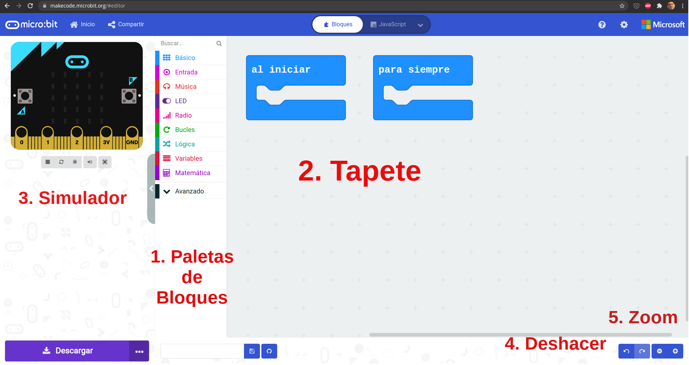

Descripción del entorno

Vamos a usar el editor de bloques de Makecode   

[Vídeo sobre el entorno](./videos/makecode_descripcion_entorno_tiene_bostezo.mkv)

## Cuenta de usuario

## Versión offline

https://makecode.microbit.org/offline-app

## Alternativas

Scratch
microblocks
python