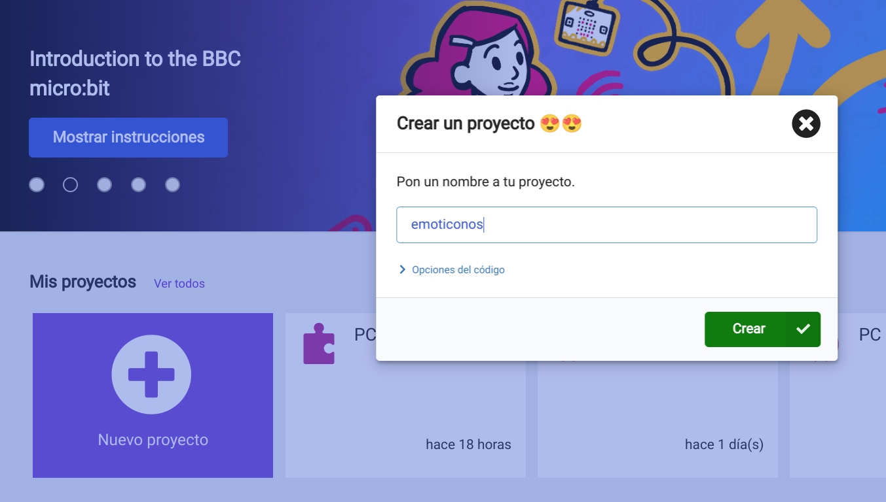
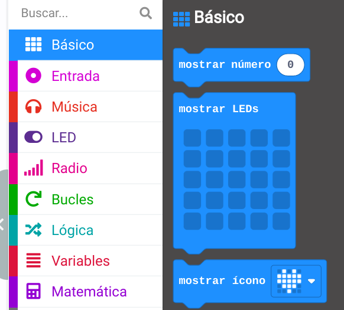
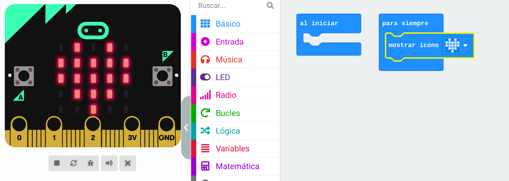
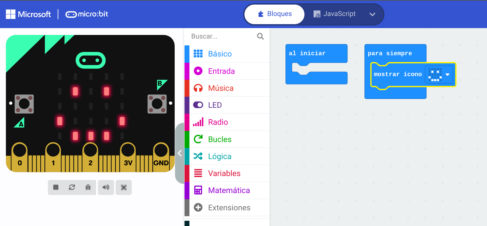
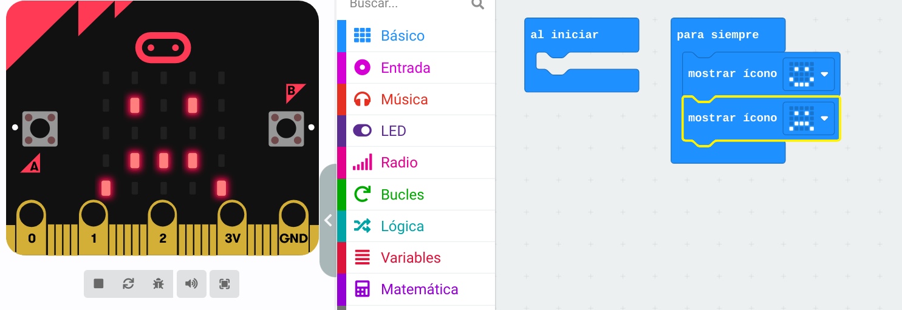
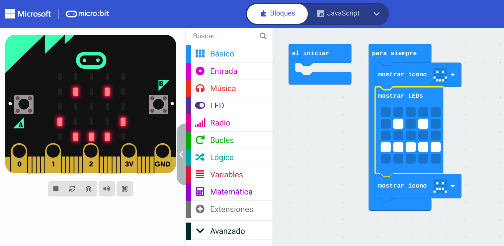
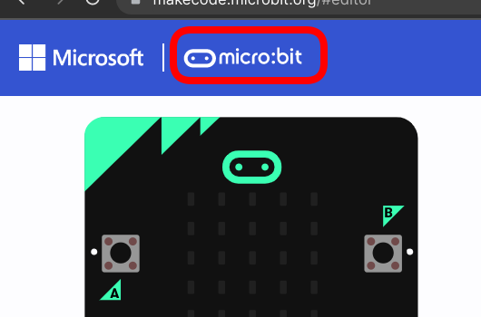

mostrando un emoticono

Necesitamos:

* micro:bit
* cable USB
* [https://makecode.microbit.org](https://makecode.microbit.org)

Desde la página de makecode pulsamos en "Nuevo proyecto" y le ponemos de nombre "emoticonos" y pulsamos el botón "Crear"

En la paleta básico encontramos bloques para mostrar dibujos en su pantalla de 5x5 leds

Arrastramos el bloque "mostrar icono" dentro del bloque "Para siempre" que tiene forma de "C"

Verás que el simulador de micro:bit que se muestra a la izquierda de la página mostrará el icono.

Ahora podemos seleccionar nuestro icono/dibujo preferido, y el simulador hará lo mismo

Si añades otro bloque de mostrar icono se mostrarán alternativamente los 2 dibujos en la pantalla

Incluso puedes crear tu propio dibujo  usando el bloque "Mostrar leds"

[Ejemplo](https://makecode.microbit.org/_DemH1JcjEJae)

* Creamos un nuevo proyecto pulsado en el logo de microbit

2.3.1 Crea tus emojis
2.3.1 Simulador

Muestra 1 emoji

Ahora anímalo

Crea tus propios emojis
