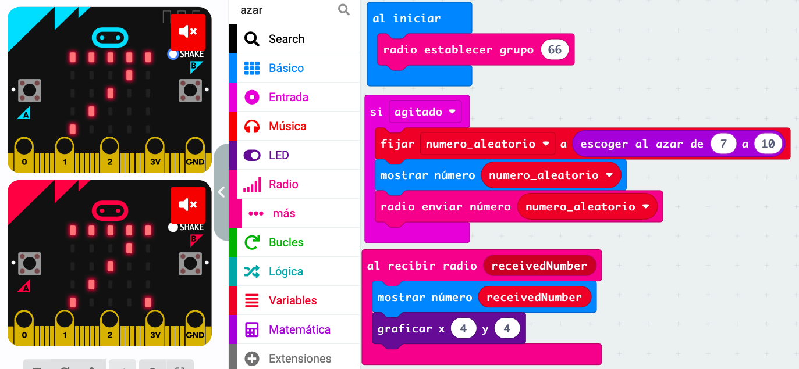
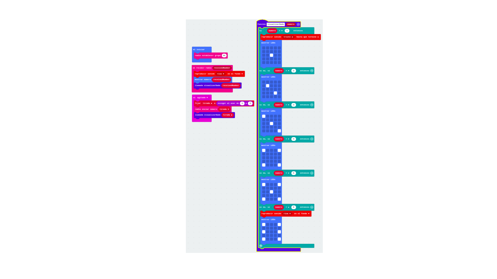

## Multieditor

Cuando trabajamos con proyectos donde se emplean comunicaciones, resulta cómodo utilizar la versión multi editor de MakeCode, que nos permite abrir dos proyectos al mismo tiempo estableciendo una comunicación de radio entre ambos.

Para ello entramos en [https://makecode.microbit.org/---multi#](https://makecode.microbit.org/---multi#)

También podemos acceder desde la página inicial de makecode en el ejemplo "multieditor"
### Dado numérico remoto

Al agitarlo se elige un número aleatorio entre 0 y 9 y se envía a todas las placas del mismo grupo

Establecemos el número de grupo para que todas las micro:bit se escuchen

[Proyecto](https://makecode.microbit.org/_ft6bim3q7ayP)

## Jugando a los dados todos juntos

Vamos a jugar a los dados todos juntos, para ello crearemos un programa que genere un número aleatorio, lo muestre por pantalla y lo envíe por radio.

Dado que tenemos que usar el número aleatorio elegido para mostrarlo en pantalla y para enviarlo, crearemos una variable donde guardaremos su valor.

Por otro lado, al recibir un número por radio lo mostraremos en pantalla y para distinguir si es el número que nosotros hemos enviado o el que hemos recibido le añadiremos un puntito encendido en la pantalla para ello usaremos la órdenes directas de LED

[Proyecto dado por radio](https://makecode.microbit.org/S09070-63534-21721-99105)

Si no establecemos un grupo de radio, todas las microbits escucharán los mensajes, si asignamos un grupo, sólo recibirán aquellos de dentro del grupo.

### Dado alfabético remoto

Cambiamos los bloques referidos a números por los correspondientes a letras

[Proyecto](https://makecode.microbit.org/_dC1hzRVkzELx)

### Ejercicio

Comparte tus emociones: selecciona con los botones A y B tu estado de ánimo y compártelo al pulsar A+B. Si lo agitas tendrás un estado aleatorio...
## Dado visual y remoto

Radio:
Fundamental establecer el mismo ID para las microbit del mismo grupo

* Dado en grupo usando radio. Todas las micro:bit tienen el mismo programa y emiten y reciben datos por radio. Creamos una función para mostrar las caras del dado tanto al recibirlos como al agitarlos y emitirlos. [Proyecto](https://makecode.microbit.org/_RRT0tffa7YVY)
    

### Compartiendo variables y valores

Para ello usaremos los bloques de envía etiqueta/valor

### Piedra papel o tijera multiuser

[Ejemplo](https://makecode.microbit.org/projects/rps-teams)

Usamos radio para comunicar placas

