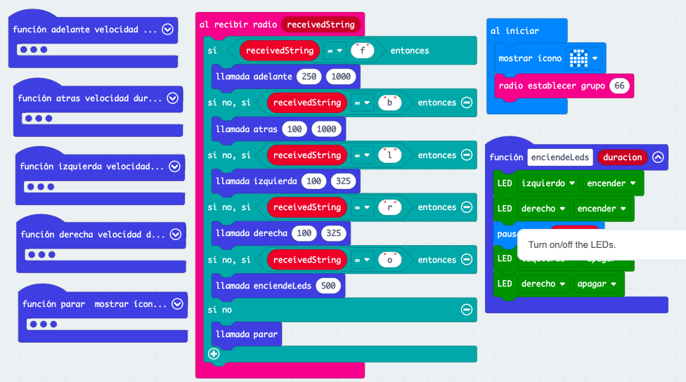
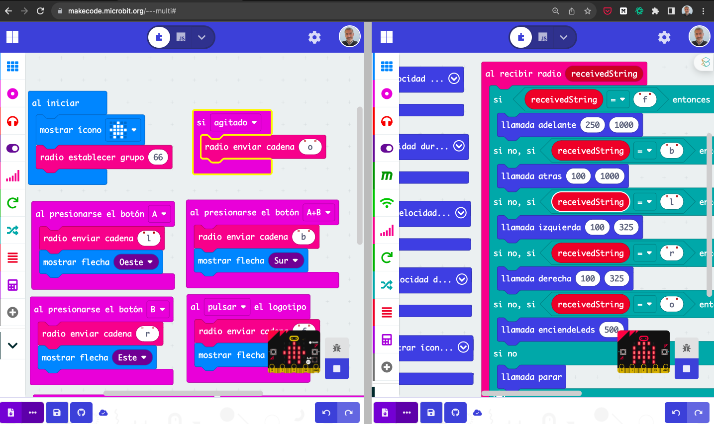
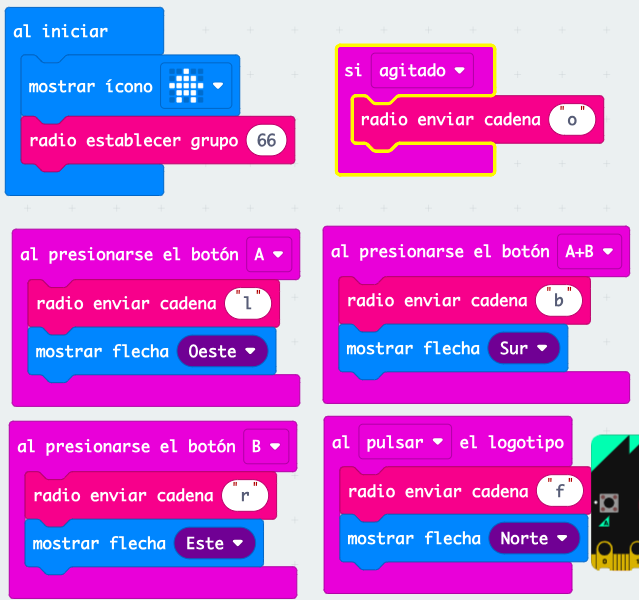
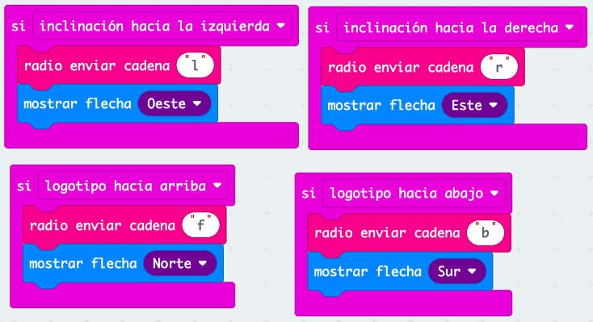
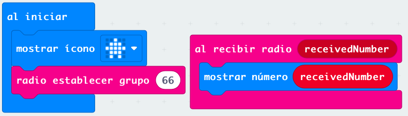
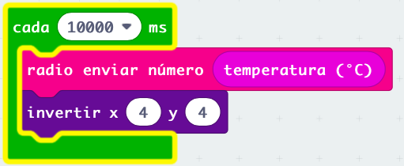
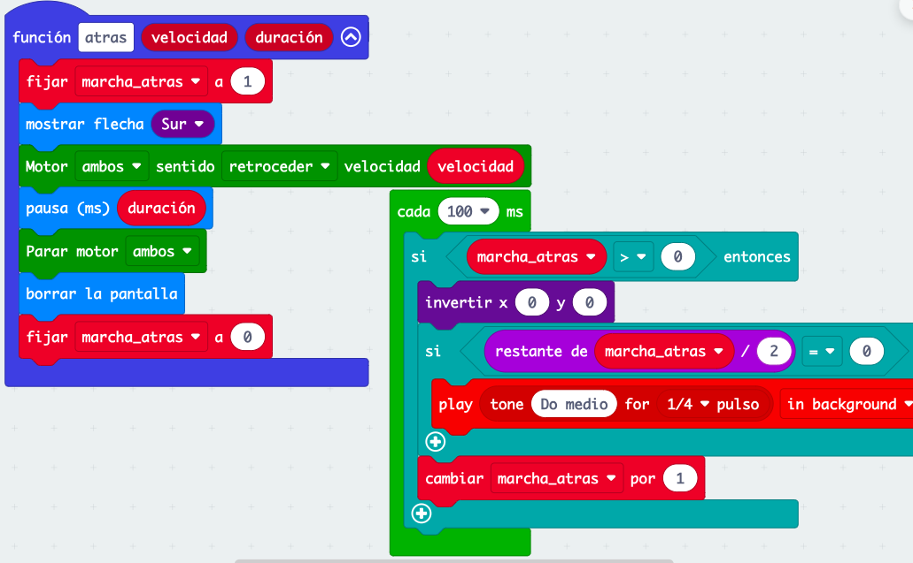

## Robot controlado remotamente

Vamos a hacer un proyecto donde controlaremos nuestro maqueen remotamente vía radio usando otra micro:bit. Esta segunda micro Bit que actuará como mando enviará los distintos comandos el robot los procesará realizando la acción correspondiente a cada uno de ellos.  

En este proyecto tenemos que establecer cuál es eran los datos enviados por radio significarán los distintos comandos.

Pueden ser datos numéricos o de texto.

Parece más sencillo si utilizamos datos de texto correspondiente a la inicial de los distintos movimientos.

Usaremos F para avanzar de "forward" en inglés, B para ir hacia atrás de Backward, L y R para los movimientos de izquierda y derecha.

Hay que tener en cuenta que los comandos tienen que escribirse exactamente igual en el mando y en el robot que lo recibe no vale que uno sea en mayúscula y otra minúscula. 

En nuestro programa del robo, una vez recibamos un dato correspondiente a un comando, comprobaremos el valor de este comando y en función de los distintos comandos posibles ejecutaremos las acciones. Esto lo haremos con varias sentencias if/else if ...

Hemos añadido también una función que permite encender y apagar los LED con una duración determinada.

Al iniciar nuestro programa mostramos una imagen en la pantalla para saber distinguir nuestro robot en los demás y asignamos el grupo de radio correspondiente que compartirán robot y su mando correspondiente.

[Proyecto del robot v1](https://makecode.microbit.org/S35595-61211-20888-06578)

## Multieditor

Cuando trabajamos con proyectos donde se emplean comunicaciones, resulta cómodo utilizar la versión multi editor de MakeCode, que nos permite abrir dos proyectos al mismo tiempo estableciendo una comunicación de radio entre ambos.

Para ello entramos en [https://makecode.microbit.org/---multi#](https://makecode.microbit.org/---multi#)

También podemos acceder desde la página inicial de makecode en el ejemplo "multieditor"

Ahora podemos abrir en un lado el mando y en otro el programa del robot, y podemos probar que funciona la lógica de las comunicaciones

## Mando

En el proyecto del mando lo que haremos será detectar las acciones del usuario que implican el envío de los diferentes comandos usaremos los botones, el logo y la diferente inclinación es posible de la placa micro Bit

[Programa mando v1](https://makecode.microbit.org/S49448-99936-47185-23078)

También podemos usar las diferentes inclinaciones de la micro Bit para que se transmitan los diferentes comando.

También podemos usar las diferentes inclinaciones de la micro:bit para que se transmitan los diferentes comandos:

* Inclinando hacia delante avanza
* Inclinándola hacia atrás retrocede 
* inclinándola a izquierda y a la derecha girará respectivamente

### Ejercicio 2: indicadores luminosos

Se propone usar los leds rojos delanteros para indicar el movimiento:

* Ambos fijos encendidos al avanzar
* El izquierdo y el derecho encendidos al girar en la respectivas direcciones

## Enviando datos desde el robot

Ahora vamos a hacer que nuestro robot envíe datos al mando, es lo que se conoce como telemetría.

Empezaremos enviando el dato de temperatura que el mando mostrará en la pantalla

En el mando sólo tenemos que mostrar en la pantalla el dato que recibamos

[Programa mando v2](https://makecode.microbit.org/S25294-09430-10433-84022)

En el robot enviaremos el dato de temperatura cada 10 segundos e invertiremos el pixel (4,4) de la pantalla para saber que ya se ha enviado.

[Programa robot v2](https://makecode.microbit.org/S11895-92138-67941-14484)

## Ejercicio propuesto 4: Sonido intermitente al ir hacia atrás

Vamos a hacer que cuando el robot vaya hacia atrás emita un sonido intermitente.

Una variable "marcha atras" hará que se active el sonido al ejecutar la función "atrás"

Para conseguir la intermitencia vamos a usar un bucle temporizador que comprobará si la variable "marcha atras" es mayor que 0 y que hará sonido si el valor de la variable es par, incrementando el valor de la variable

[Proyecto robot 2.5 (con sonido intermitente en marcha atrás)](https://makecode.microbit.org/S68933-61665-18651-64398)

## Mejoras controlador

* Usar los leds RGB para identificar a los robots
* Añadir una variable "Desviación" entre 0.8 y 1.2 que nos dice cómo deben ser las velocidades izda y drcha para que vaya recto. 

## Prácticas

* Hacemos un test de ajuste para comprobar que el movimiento hacia adelante y atrás sea recto.
* Dibujamos un circuito con cajas o cinta aislante en el suelo