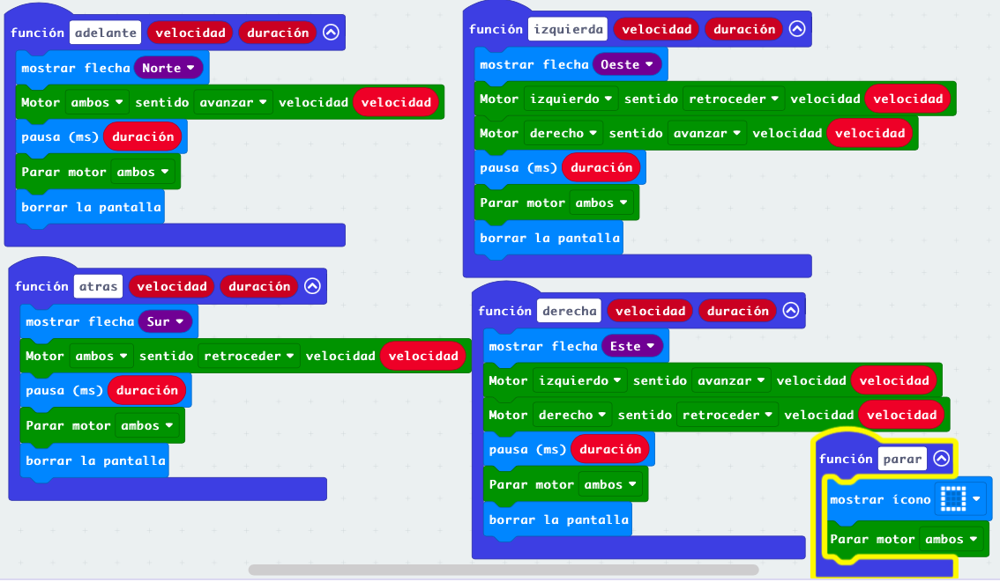
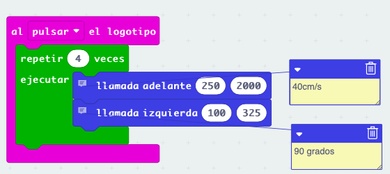

# Sesión 2 - funciones para control de robot Maqueen o similares

Vamos a crear Un conjunto de funciones que nos van a permitir controlar nuestro robot McQueen o similar.

Éstas funciones las podremos utilizar en distintos proyectos. Como MakeCode no permite la creación de librerías, lo que haremos será duplicar el proyecto de esta funciones y añadirle la funcionalidad extra.

## Funciones de movimiento

Vamos a crear cinco funciones básicas que controlarán el movimiento en las distintas direcciones de nuestro robot McQueen.

Vamos a crear cinco funciones básicas que controlarán el movimiento en las distintas direcciones de nuestro robot McQueen.

Cada una de estas funciones realizará el movimiento durante un cierto tiempo y con una velocidad dada. Para ello añadiremos dos argumentos que serán la velocidad y la duración de este movimiento. Pasado el tiempo de la duración detendremos todo movimiento.

Para controlar nuestro robot maqueen incluiremos la extensión Maqueen (o la correspondiente si es otro robot) en el proyecto.

Todas las funciones tienen el mismo formato:

* 2 argumentos: velocidad y duración.
* Mostraremos una imagen en pantalla mostrando la dirección del movimiento.
* Ejecutamos la orden correspondiente del movimiento de la extensión maqueen.
* Esperamos el tiempo correspondiente a la duración del comando.
* Paramos el movimiento. Es importante recalcar que hay que detener los movimiento, estos NO se detienen solos pasado el tiempo esperado.

### Ejercicio 1: movimiento como en coches de radiocontrol

Los movimientos que hemos utilizado están pensado para que el robot tenga un movimiento más preciso y sobre todo no se caiga de la mesa...

Podemos diseñar otro conjunto de funciones que no detengan el movimiento pasado un tiempo, sino que sea el propio usuario el que tenga que mandar la orden de parada. Para eso basta con eliminar la pausa y la orden de parar.

[Proyecto de funciones de movimiento del robot](https://makecode.microbit.org/S74033-29364-61141-16598)

### Ejemplo: dibujando un cuadrado

Podemos usar las funciones creadas para realizar movimientos complejos, por ejemplo, dibujar un cuadrado

También podíamos programar la solución de un laberinto...