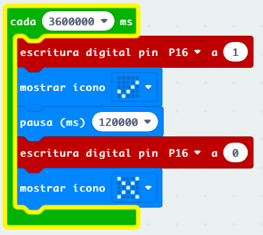

## Sistema de Riego

Se trata de un sistema que riegue nuestra plantas de manera automática. 

Vamos a realizar distintas versiones, empezando por las más sencillas

## Riego v0 - Aviso

Nuestra micro:bit nos avisa cuando ha pasado un tiempo sin regar...

TODO: falta imagen y proyecto
### Riego v1 - Temporización

Sistema de control de riego más sencillo, simplemente se activa cada cierto tiempo y con una duración concreta.

Es tan sencillo que se podría hacer sólo con electrónica, sin necesitad de placa controladora.

### Riego v2 - Medida de humedad

En esta versión determinamos la humedad del suelo y si está por debajo de cierto valor encendemos el riego

Lo apagaremos cuando se alcance el valor de humedad establecido.

Para determinar estos valores de humedad (umbrales) hacemos un proceso de **calibración** en situaciones reales

[Sistema de riego sencillo](https://www.tinkercad.com/projects/Automatic-Plant-Watering-System-Using-a-Microbit)

![[Riego_microbit.png]]

## **Proyecto: Sistema de riego automático con Micro:bit**

**Introducción**

Este proyecto tiene como objetivo la creación de un sistema de riego automático para plantas utilizando una placa Micro:bit. El sistema monitorizará la humedad del suelo y activará una bomba de agua cuando sea necesario para mantener las plantas hidratadas.

**Materiales**

- Placa Micro:bit
- Sensor de humedad del suelo
- Módulo de relé
- Bomba de agua
- Cables
- Caja para el proyecto
- Pilas o fuente de alimentación

**Esquema del sistema**

1. El sensor de humedad del suelo se conecta a la placa Micro:bit.
2. El módulo de relé se conecta a la placa Micro:bit y a la bomba de agua.
3. La bomba de agua se coloca en un recipiente con agua.
4. El sistema se monta en la caja del proyecto.

**Funcionamiento del sistema**

1. La placa Micro:bit lee los datos del sensor de humedad del suelo.
2. Si la humedad del suelo es inferior a un valor umbral predefinido, la placa Micro:bit activa el módulo de relé.
3. El módulo de relé enciende la bomba de agua.
4. La bomba de agua riega las plantas hasta que la humedad del suelo alcanza un nivel adecuado.
5. La placa Micro:bit apaga el módulo de relé y la bomba de agua se apaga.

**Programación de la Micro:bit**

El código para programar la Micro:bit se puede escribir en diferentes lenguajes de programación, como MakeCode, Python o MicroPython. El código debe incluir las siguientes funciones:

- Leer los datos del sensor de humedad del suelo.
- Comparar los datos del sensor con el valor umbral predefinido.
- Activar el módulo de relé si la humedad del suelo es inferior al valor umbral.
- Apagar el módulo de relé cuando la humedad del suelo alcanza un nivel adecuado.

**Ventajas del sistema**

- **Riego automático:** El sistema riega las plantas automáticamente, sin necesidad de intervención humana.
- **Ahorro de agua:** El sistema solo riega las plantas cuando es necesario, lo que ayuda a ahorrar agua.
- **Plantas más sanas:** Las plantas que se riegan automáticamente suelen ser más sanas y fuertes.
- **Fácil de usar:** El sistema es fácil de montar y programar.

**Extensiones del proyecto**

- Se puede añadir un sensor de luz para que el sistema riegue las plantas solo durante las horas de sol.
- Se puede añadir un sensor de temperatura para ajustar la frecuencia de riego en función de la temperatura ambiente.
- Se puede utilizar una pantalla LCD para mostrar información sobre la humedad del suelo y el estado del sistema.
- Se puede conectar el sistema a Internet para controlar el riego de forma remota.

**Conclusión**

Este proyecto es una forma divertida y educativa de aprender sobre electrónica, programación y agricultura. El sistema de riego automático con Micro:bit es una herramienta útil para mantener las plantas sanas y hidratadas, incluso cuando no estás en casa.

**Recursos adicionales**

- [https://m.youtube.com/watch?v=o9fTNPH4Rc8](https://m.youtube.com/watch?v=o9fTNPH4Rc8)
- [https://blog.bricogeek.com/tag/riego](https://blog.bricogeek.com/tag/riego)
- [https://makecode.microbit.org/_1DrEhHhoDdwr](https://makecode.microbit.org/_1DrEhHhoDdwr)
- [https://www.youtube.com/watch?v=E0YEmuE7akk](https://www.youtube.com/watch?v=E0YEmuE7akk)

**Nota:**

Este es solo un ejemplo de proyecto. Puedes adaptarlo a tus necesidades y preferencias.

Espero que esta información te sea útil para crear tu propio sistema de riego automático con Micro:bit.

## **Proyecto: Sistema de riego automático con Micro:bit**

**Introducción**

Este proyecto tiene como objetivo la creación de un sistema de riego automático para plantas utilizando una placa Micro:bit. El sistema monitorizará la humedad del suelo y activará una bomba de agua cuando sea necesario para mantener las plantas hidratadas.

**Materiales**

- Placa Micro:bit
- Sensor de humedad del suelo
- Módulo de relé
- Bomba de agua
- Cables
- Caja para el proyecto
- Pilas o fuente de alimentación

**Esquema del sistema**

1. El sensor de humedad del suelo se conecta a la placa Micro:bit.
2. El módulo de relé se conecta a la placa Micro:bit y a la bomba de agua.
3. La bomba de agua se coloca en un recipiente con agua.
4. El sistema se monta en la caja del proyecto.

**Funcionamiento del sistema**

1. La placa Micro:bit lee los datos del sensor de humedad del suelo.
2. Si la humedad del suelo es inferior a un valor umbral predefinido, la placa Micro:bit activa el módulo de relé.
3. El módulo de relé enciende la bomba de agua.
4. La bomba de agua riega las plantas hasta que la humedad del suelo alcanza un nivel adecuado.
5. La placa Micro:bit apaga el módulo de relé y la bomba de agua se apaga.

**Programación de la Micro:bit**

El código para programar la Micro:bit se puede escribir en diferentes lenguajes de programación, como MakeCode, Python o MicroPython. El código debe incluir las siguientes funciones:

- Leer los datos del sensor de humedad del suelo.
- Comparar los datos del sensor con el valor umbral predefinido.
- Activar el módulo de relé si la humedad del suelo es inferior al valor umbral.
- Apagar el módulo de relé cuando la humedad del suelo alcanza un nivel adecuado.

**Ventajas del sistema**

- **Riego automático:** El sistema riega las plantas automáticamente, sin necesidad de intervención humana.
- **Ahorro de agua:** El sistema solo riega las plantas cuando es necesario, lo que ayuda a ahorrar agua.
- **Plantas más sanas:** Las plantas que se riegan automáticamente suelen ser más sanas y fuertes.
- **Fácil de usar:** El sistema es fácil de montar y programar.

**Extensiones del proyecto**

- Se puede añadir un sensor de luz para que el sistema riegue las plantas solo durante las horas de sol.
- Se puede añadir un sensor de temperatura para ajustar la frecuencia de riego en función de la temperatura ambiente.
- Se puede utilizar una pantalla LCD para mostrar información sobre la humedad del suelo y el estado del sistema.
- Se puede conectar el sistema a Internet para controlar el riego de forma remota.

**Conclusión**

Este proyecto es una forma divertida y educativa de aprender sobre electrónica, programación y agricultura. El sistema de riego automático con Micro:bit es una herramienta útil para mantener las plantas sanas y hidratadas, incluso cuando no estás en casa.

**Recursos adicionales**

- [https://m.youtube.com/watch?v=o9fTNPH4Rc8](https://m.youtube.com/watch?v=o9fTNPH4Rc8)
- [https://blog.bricogeek.com/tag/riego](https://blog.bricogeek.com/tag/riego)
- [https://makecode.microbit.org/_1DrEhHhoDdwr](https://makecode.microbit.org/_1DrEhHhoDdwr)
- [https://www.youtube.com/watch?v=E0YEmuE7akk](https://www.youtube.com/watch?v=E0YEmuE7akk)

**Nota:**

Este es solo un ejemplo de proyecto. Puedes adaptarlo a tus necesidades y preferencias.

Espero que esta información te sea útil para crear tu propio sistema de riego automático con Micro:bit.