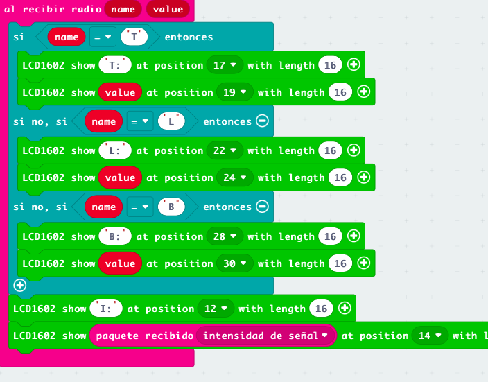

## Pantalla LCD

Vamos a usar una pantalla LCD que conectamos a la micro:bit a través del extensor.


Este LCD usa conexión I2C que sólo requiere de 4 cables: Vcc, GND, SDA y SCL.


Uniremos los cables correspondientes, podemos ver los nombres de los pines en la parte de abajo del extensonr y en el LCD. Tenemos que asegurarnos de que la alimentación de V2 es de 5V para lo que comprobaremos los jumpers de alimentación.

Para controlar el LCD usaremos una extensión, hay varias en makecode. En este caso usaremos Makerkit LCD que es más versátil. 

Cargamos la extensión y añadimos los bloques para mostrar los datos y crear un carácter de usuario para mostrar los grados

Esta extensión nos permite crear caracteres de usuario

Mostramos los datos y los carateres de usuario


Otra de las ventajas de esta librería es que nos facilita el cálculo de la posición y la confección de las pantallas


[Programa test LCD](https://makecode.microbit.org/S16394-50348-99702-05700)

## Añadir pantalla LCD al mando del robot

Ahora vamos a añadir la pantalla LCD al mando de nuestro robot, mostraremos los datos de la temperatura y luz locales y posteriormente mostraremos los datos de temperatura que nos envíe el robot.

Para ello añadiremos los bloques del ejemplo que hemos hecho del LCD al mando.

* Hacemos una copia del programa del mando
* Abrimos los dos programas en javascript
* Añadimos la extensión makerbit LCD al programa del mando
* Copiamos las líneas del test LCD. Primero las del bloque "iniciar" que están al principio

```javascript
makerbit.connectLcd(39)
makerbit.showStringOnLcd1602("Hola mando", makerbit.position1602(LcdPosition1602.Pos3), 16)
makerbit.lcdMakeCharacter(LcdChar.c1, makerbit.lcdCharacterPixels(`
    . # . . .
    # . # . .
    . # . . .
    . . . # #
    . . # . .
    . . # . .
    . . . # #
    . . . . .
    `))
```

* Añadimos las líneas del bloque temporal

```javascript
loops.everyInterval(500, function () {
    makerbit.showStringOnLcd1602("T:", makerbit.position1602(LcdPosition1602.Pos17), 16)
    makerbit.showStringOnLcd1602("" + (input.temperature()), makerbit.position1602(LcdPosition1602.Pos19), 2)
    makerbit.lcdShowCharacter1602(LcdChar.c1, makerbit.position1602(LcdPosition1602.Pos21))
    makerbit.showStringOnLcd1602("Luz:", makerbit.position1602(LcdPosition1602.Pos23), 16)
    makerbit.showStringOnLcd1602("" + (input.lightLevel()), makerbit.position1602(LcdPosition1602.Pos27), 16)
})
```
* Comprobamos que no hay errores y lo probamos


Añadimos al bloque "iniciar" el icono que aparece en nuestro maqueen y para distinguir entre la microbit del mando y del robot cambiamos el led de arriba a la izquierda con el bloque "graficar" de la paleta LEDs. Según el icono que uses puedes usar otro punto de la pantalla


### Mostrando datos de telemetría del robot

Ahora vamos a hacer que robot nos envíe los datos de temperatura y los mostraremos en el LCD del mando. 

En el mando haremos que al recibir un número por radio lo muestre en el LCD


En el robot añadiremos un bucle temporal que cada segundo nos envíe el dato de temperatura del robot


Los programas quedan así:

[Mando maqueen 2.5](https://makecode.microbit.org/S15891-40327-08248-29896)

[Robot maqueen 2.5](https://makecode.microbit.org/S62199-18030-90259-31889)

Ideas:

* Añadir una pantalla OLED o LCD a maqueen para mostrar los datos en local.
* Enviar más datos de telemetría desde maqueen. Para ello usaremos el envio por radio de datos con metadatos, donde cada dato que se envía lleva una etiqueta para identificarlo a su llegada


Ahora el mando tiene que ver el nombre de cada paquete que recibe para mostrarlo en su zona correspondiente. También mostremos la intensidad de la señal del paquete que nos da idea de la distancia al robot (o del nivel de su batería). 



Para mostrar bien los datos reordenaremos las posiciones de la pantalla para ajustarlo

[Mando v3](https://makecode.microbit.org/S08791-16176-40876-56238)

[Robot v3](https://makecode.microbit.org/S45866-77088-58989-92614)