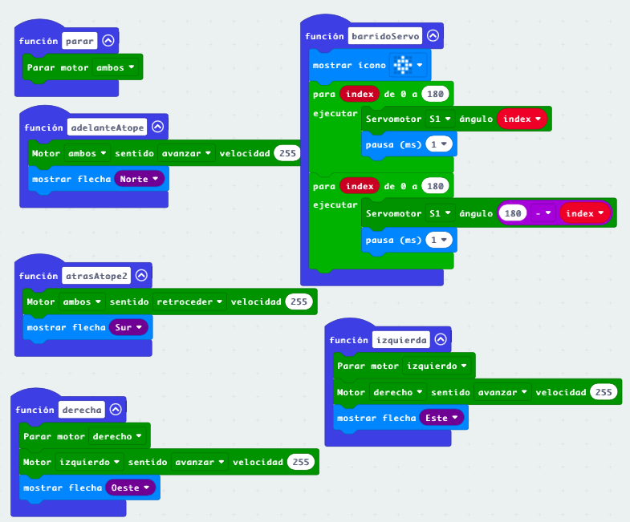
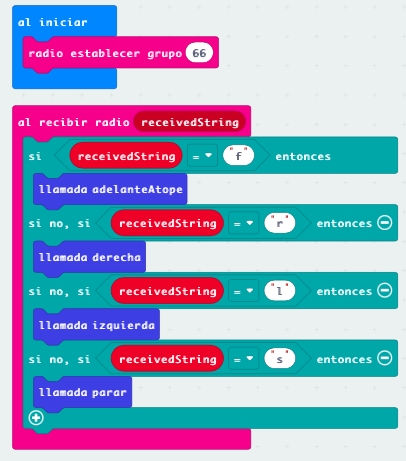
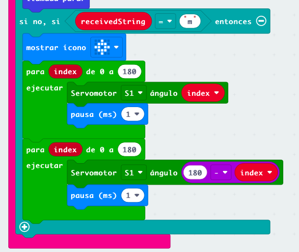
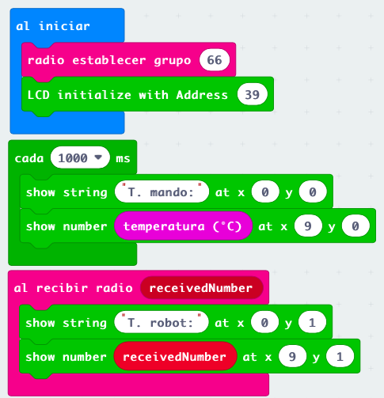

## Proyecto: Rover marciano

Se trata de crear un rover marciano que podemos controlar remotamente, que nos envía datos y que ademas es capaz de reaccionar ante obstáculos. 

Necesitamos 2 micro:bit, una para el mando y otra con maqueen.

Haremos 3 versiones:

0. Funciones de control de maqueen. Vamos a definir una serie de funciones para facilitar el uso de maqueen:

1. Control remoto de maqueen vía radio. Usaremos los botones y el logo para enviar órdenes usando caracteres/cadenas

2. Añadimos el extensor y conectamos un pulsador en P1 para ampliar el mando

Conectamos un servo en el S1 de maqueen. El servo hará un barrido entre 0 y 180

3. El rover enviará datos que el receptor mostrará.

El rover envía la temperatura vía radio cada segundo como número. 

[Proyecto rover v3](https://makecode.microbit.org/_bxcEpVUyTXCv)

El receptor mostrará los datos en un LCD que hemos conectado vía I2C (pines 20-SDA y 19 SCL)

Añadimos la configuración del LCD (Address 0x27=69)

Añadimos una tarea cada segundo que mostrará en la fila 0 del LCD la temperatura del mando

Cuando recibamos datos numéricos del rover los mostramos en la fila 1

[Proyecto mando v3](https://makecode.microbit.org/_EADA3w304YCR)

