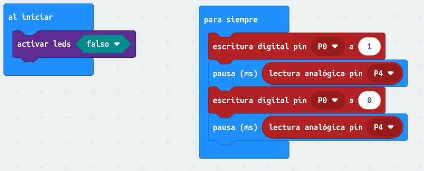

## Estación meteorológica

Se trata de un sistema que utilizando un sensor de temperatura y humedad, DHT11, muestra los resultados en una pantalla LCD 

Conexión de componentes: 

* micro:bit
* Extensor
* lcd
* sensor de temperatura

[Ejemplo con LCD y sensores](https://makecode.microbit.org/_D0wECTdkHMK5)

LM35 o DHT11 + LCD

## Proyectos de iluminación

¡¡Cuidado con la alimentación!! Ya empezamos a añadir dispositivos que consumen. Recuerda alimentar el extensor o bien con pilas o con su conector USB. Si llegamos a conectar más dispositivos puedes usar un cargardo de móvil USB para alimentarlo, que el puerto USB del PC da sólo 500mA (poco para motores, servos o LEDs potentes)

### Paradeo de led de 3W

Vamos a hacer que nuestro LED de 3W comience a parpadear tras pulsar el botón A, y lo detendremos al pulsar el botón B

Podemos alimentar el LED con 3.3v o con 5V, lo conectaremos al pin 0

Para encender el led usamos el bloque "escritura digital" con el que activaremos el pin 0 al que está conectada la señal del control del LED. Esta instrucción digital enciende o apaga el led, todo o nada.

El programa es similar al que ya hemos hecho para hacer sonidos intermitentes: usamos una variable para controlar el estado del parpadeo:

* Si es 0 el parpadeo no está activo
* Si es distinto de 0 el parpadeo está activo:
    * Si es par se enciende el led
    * Si es impar se apaga el led
* Cada vez que apagamos o encendemos el led incrementamos el valor de la variable "parpadeo"

Al pulsar el botón "B" ponemos a 0 la variable "parpadeo" y apagamos el led por si estuviera activo

[Parpadeo led 3W](https://makecode.microbit.org/S34526-27757-70696-04858)

Ejercicio opcional: permitir que se active o desactive el parpadeo remotamente con otra micro:bit usando la radio

## Encendido progresivo del LED

Ahora vamos a hacer que el encendio o apagado del led se haga progresivamente, para ello usaremos una funcionalidad que tienen los microcontroladores que se llama PWM: se trata de usar la velocidad de procesamiento y lo lento que funciona nuestro ojo para encender o apagar rápidamente el LED, el efecto visual será que el LED sube o baja de brillo.

Realizamos un ciclo unas 500 veces por segundo y durante ese ciclo mantemos el led encendido un % del tiempo. Si es el 100% el parecerá iluminado a máximo brillo, si es al 50% estará a medio gas.

Esta técnica también la podemos usar para controlar la velocidad de un motor DC de corriente continua. De hecho es lo que se usa para controlar la velocidad en los patinetes, drones u otros vehículos eléctricos. De ahí el característico zumbido que oímos.

El montaje es el mismo que antes.

Para el programos usaremos el bloque "escritura analógica" donde indicaremos el % de PWM con un número entre 0 y 1023 (para el 100%)

[Programa encendido progresivo](https://makecode.microbit.org/S73482-23561-45839-11124)

Otra forma de hacer el apagado progresivo es usando la idea feliz de que si la variable index hacer el bucle 0-1023, (1023 - index) hace justo el contrario...

Mejoras: 

* Usar una variable para guardar el nivel de luz y hacer el apagado o encendido desde ese valor.
* Permitir que el apagado o encendido se pueda hacer en cualquier momento

## Selección de pines

Para seleccionar dónde conectar cada componente vamos a usar el [esquema de pines de la micro:bit](https://tech.microbit.org/hardware/edgeconnector/) para ver las capacidades de cada pin. Más detalles en [https://microbit.pinout.xyz](https://microbit.pinout.xyz)

## Estroboscopio

Si hacemos parpadear el led a cierda velocidad podemos conseguir un efector que se llama estroboscópico y que consiste en que parece que detemos el movimiento de las cosas.

Podemos usar un potenciómetro, que conectaremos a un pin analógico (P4), para controlar la velocidad del parpadeo

El potenciómetro da una lectura entre 0 y 1023 que será el valor que usaremos para hacer la espera entre parpadeos

Desactivamos la pantalla de leds de la microbit porque el pin P4 se usa para ello y habría conflicto

[Programa estroboscopio](https://makecode.microbit.org/S48985-66137-69896-57971)

## Iluminación automática

Vamos a añadir un sensor de luz (resistencia LDR) para medir la luz ambiental. En función del valor leído encenderemos más o menos nuestro led.

Para ver los valores que da nuestro sensor LDR, añadiremos la pantalla LCD donde mostraremos los valores.

En mi caso tenemos valores entre 450 y 1000. Vamos a hacer 3 tramos: 

* Por debajo de 600 donde encenderemos al 100% el LED
* Entre 600 y 800 donde lo encenderemos al 30% 
* Por encima de 800 donde lo apagaremos

[Programa iluminación automática](https://makecode.microbit.org/S98548-37498-29977-17000)

Para programar los intervalos también podíamos usar varios bloques if con el rango de valores, de esta forma podemos hacer que los rangos estén separados y no den lugar a problemas de intermitencias no deseadas. 

En este caso hemos dejado una separación de 25 entre los estados. Este fenómeno se denomina histéresis

[Programa iluminación automática v2](https://makecode.microbit.org/S81867-74028-84353-24528)