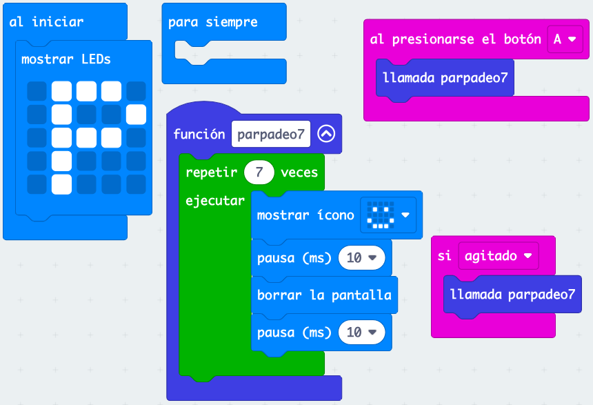
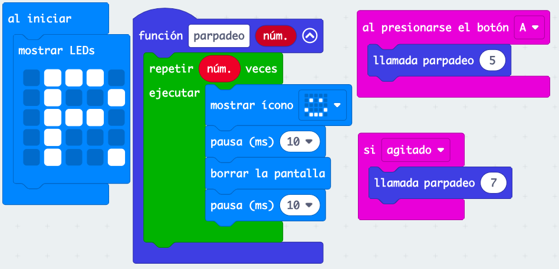
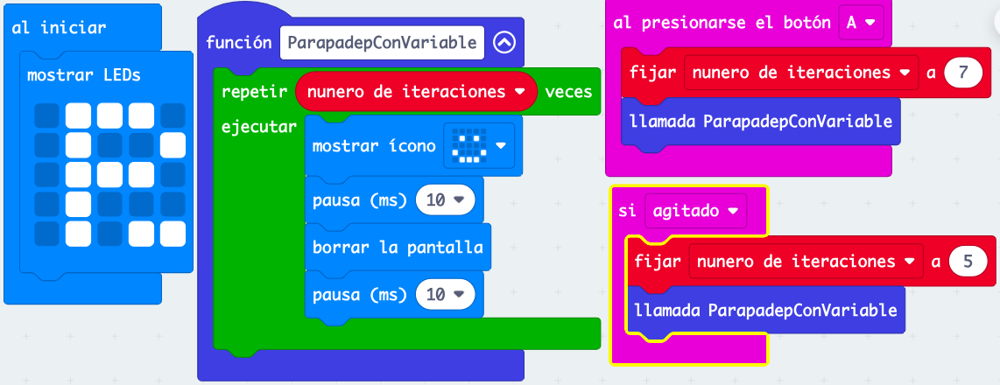

## [Ejemplo sencillo de función](https://makecode.microbit.org/S48672-14350-88362-32934)

* Una función es un grupo de sentencias (bloques) al que le damos un nombre y que podemos usar en cualquier parte de nuestro programa
* Nos evita repetir código (el cortar y pegar casi nunca es una buena opción)
* Toda función tiene un nombre y una declaración/definición donde incluimos los bloques/sentencias que contendrá
* Llamamos a la función desde varias partes de nuestro proyecto

## [Función con argumentos](https://makecode.microbit.org/S68206-42731-92193-32520)

* A veces tenemos que funciones que tienen casi el mismo comportamiento, pero con una leve modificación, como en nuestro caso que queremos que a veces haga un número de repeticiones y otras veces otras. Podemos conseguir este comportamiento añadiendo un argumento (o parámetro) que es una variable cuyo valor podemos modificar. 
* Los argumentos pueden ser de distintos tipos, nosotros usaremos de tipo numérico, indicando el número de repeticiones.
* Podemos editar la función del ejemplo anterior y añadir un argumento de tipo numérico
* Dentro de la función podemos usar el argumento como si de una variable se tratara. Esta variable sólo se puede usar dentro de la función, es lo que se conoce como una variable local.
* Para llamar a la función ahora tenemos que dar un valor a este argumento, lo haremos desde el bloque de "llamada a la función"

Ejercicio: edita la función (pulsando el botón derecho y "Editar función" y añade un segundo argumento para controlar la duraciónd el parpadeo)

## [Variables globales](https://makecode.microbit.org/S89927-38884-67925-88102)

* Una variable global es aquella a la que podemos acceder desde cualquier parte del programa.
* Podemos conseguir un comportamiento igual al anterior sin usar argumentos usan una variable local y cambiando su valor antes de llamar a la función
* Esta solución es más compleja:
    * Tenemos que crear la variable a mano
    * Tenemos que cambiar su valor manualmente
    * Es menos eficiente usar variables globales
* Por alguna razón que se escapa esta manera le parece más intuitiva a mucha gente

